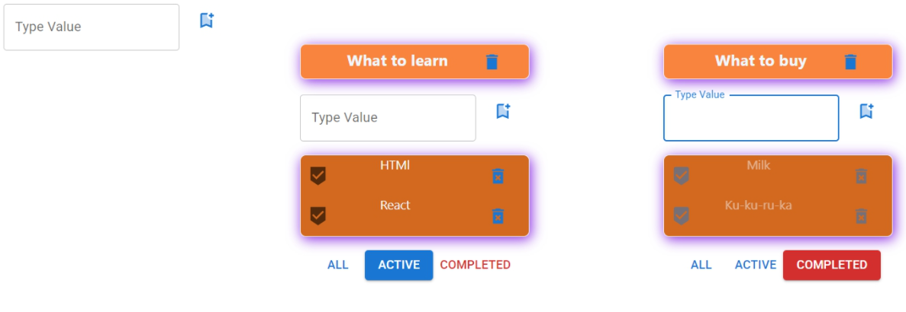

# Todolist project

Service and set of software for task management. When a task is completed, it is usually crossed off the list. Tasks can contain notes. Tasks can be placed in projects, sorted by filters, labeled, edited.  

<h2>Technologies: </h2>

- React  
- TypeScript  
- Redux Toolkit  
- React-Redux  
- React-Router-Dom  
- Redux-Thunk  
- Axios  
- Formik  
- Material-UI

<h2>
Visual stages of the project
</h2>

### My Todolist project without MUI  
  
  
### My Todolist project with MUI 
  
  